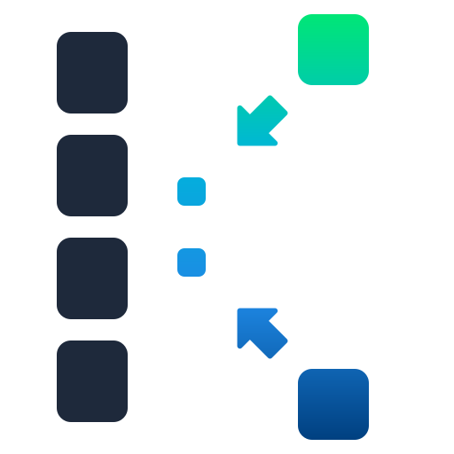

<h1 align="center">KFlate</h1>

<p align="center">Pure Kotlin Multiplatform DEFLATE, GZIP, and ZLIB compression.</p>

<p align="center">
  
</p>

<p align="center">
  <a href="https://central.sonatype.com/artifact/com.rafambn/KFlate">
    
  </a>
  <a href="https://opensource.org/licenses/Apache-2.0">
    
  </a>
  
</p>

<p align="center">
  KFlate is a Kotlin Multiplatform port of the npm <a href="https://github.com/101arrowz/fflate"><code>fflate</code></a> library. It provides compression and decompression with configurable levels, dictionary support, and both blocking and streaming APIs across KMP targets.
</p>

<table align="center">
  <tr>
    <td align="center">
      <a href="https://kflate.rafambn.com"><strong>KFlate Web Compressor (Powered by WASM)</strong></a>
    </td>
  </tr>
</table>

### Key Features

- **Pure Kotlin Implementation**: No native dependencies, works everywhere Kotlin runs.
- **Multiplatform Support**: JVM, Android, JS (Browser/Node), WASM, and native targets.
- **Multiple Compression Formats**: Raw DEFLATE, GZIP with optional headers, and ZLIB with dictionary support.
- **Flexible APIs**: Both blocking and streaming (`kotlinx-io`) interfaces.
- **Configurable Compression**: Compression levels 0-9 with intelligent hash table sizing.
- **Dictionary Support**: Full preset dictionary support for DEFLATE/ZLIB (max 32 KB).
- **Production Ready**: Tested against standard tools and libraries.

### Performance

KFlate includes JVM, Linux Native, and Wasm benchmark tasks for RAW DEFLATE. The comparison baseline is Kompress, which maps to `java.util.zip`, platform `zlib`, and npm `fflate`.

For benchmark scope, result interpretation, and comparison guidance, see [BENCHMARKING.md](BENCHMARKING.md).

### Setup

Add KFlate to your `commonMain` dependencies:

```kotlin
kotlin {
    sourceSets {
        commonMain.dependencies {
            implementation("com.rafambn:KFlate:1.1.0")
        }
    }
}
```

### Usage

With KFlate, you select a format config and call the same API to compress/decompress:

### Raw DEFLATE

```kotlin
val input = "hello".encodeToByteArray()
val deflated = KFlate.compress(input, RAW())
val inflated = KFlate.decompress(deflated, Raw())
```

### GZIP

```kotlin
val input = "hello".encodeToByteArray()

val options = GZIP(
    filename = "hello.txt",
    comment = "example",
    extraFields = mapOf("AB" to byteArrayOf(1, 2)),
    includeHeaderCrc = true
)

val gz = KFlate.compress(input, options)
val roundTrip = KFlate.decompress(gz, Gzip())
```

### ZLIB

```kotlin
val input = "hello".encodeToByteArray()
val z = KFlate.compress(input, ZLIB())
val out = KFlate.decompress(z, Zlib())

val dict = "common".encodeToByteArray()
val zWithDict = KFlate.compress(input, ZLIB(dictionary = dict))
```

### Configuration Options

- **`level`**: Compression level 0–9 (default: 6)
  - 0: No compression
  - 1–3: Fast compression
  - 4–6: Balanced (6 is default)
  - 7–9: Maximum compression (9 uses full 1M entry hash table)
- **`bufferSize`**: Internal hash table size (optional, auto-sized per level)
- **`dictionary`**: Preset dictionary up to 32 KB (DEFLATE/ZLIB only)

### GZIP-Specific Options

- `filename`: Original filename
- `comment`: File comment
- `extraFields`: Custom header fields
- `mtime`: Modification time
- `includeHeaderCrc`: Include CRC16 of header

### Decompression Options

- **`dictionary`**: Preset dictionary for DEFLATE/ZLIB (required if compression used one)
